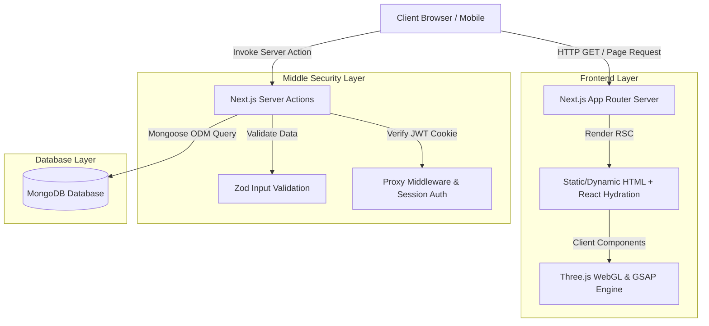
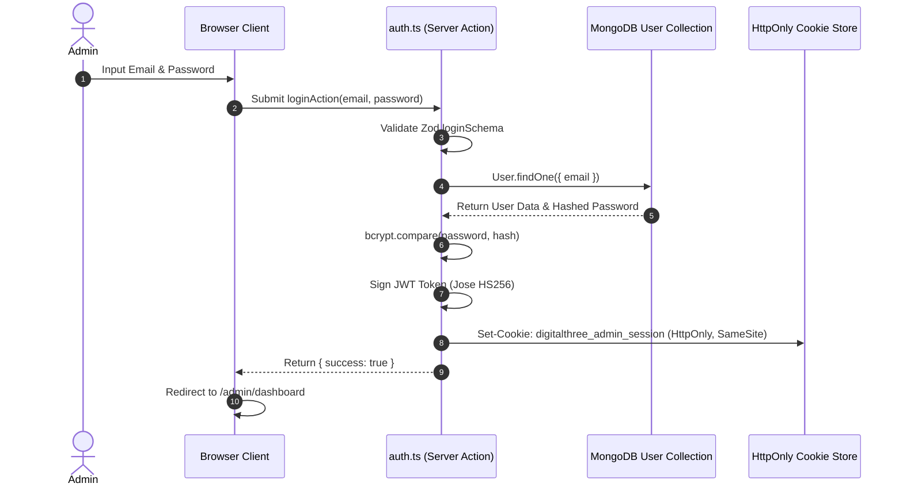

# Bab 04 — Arsitektur Sistem

## 4.1 Gambaran Umum Arsitektur

Aplikasi **DIGITAL THREE** mengadopsi arsitektur terintegrasi berbasis **Next.js App Router Fullstack Architecture**. Aplikasi memisahkan lapisan rendering antarmuka pengguna (*Client UI & Server Components*) dari lapisan logika bisnis (*Server Actions*) dan sumber data (*MongoDB via Mongoose*).

## 4.2 Alur Permintaan & Respon (Request-Response Lifecycle)

1. **Routing & Middleware**: Permintaan awal dari pengguna akan diperiksa oleh `src/proxy.ts` (Next.js Middleware). Jalur sensitif `/admin/*` diperiksa keberadaan cookie `digitalthree_admin_session`.
2. **Server Component Rendering**: Halaman publik (seperti `/` dan `/portfolio`) memanggil Mongoose ODM langsung dari Server Component untuk mengambil data terenkapsulasi tanpa API tambahan.
3. **Client Component Execution**: Efek visual 3D (Three.js), kanvas shader GLSL, serta animasi scrolling (GSAP ScrollTrigger) berjalan secara terisolasi di sisi klien (`"use client"`).
4. **Server Actions (Mutasi Data)**: Formulir publik (Kontak) atau dashboard admin (CRUD) memanggil Server Actions di `src/actions/`. Setiap aksi memvalidasi input dengan skema Zod sebelum mengubah data di MongoDB.

## 4.3 Alur Autentikasi Admin

