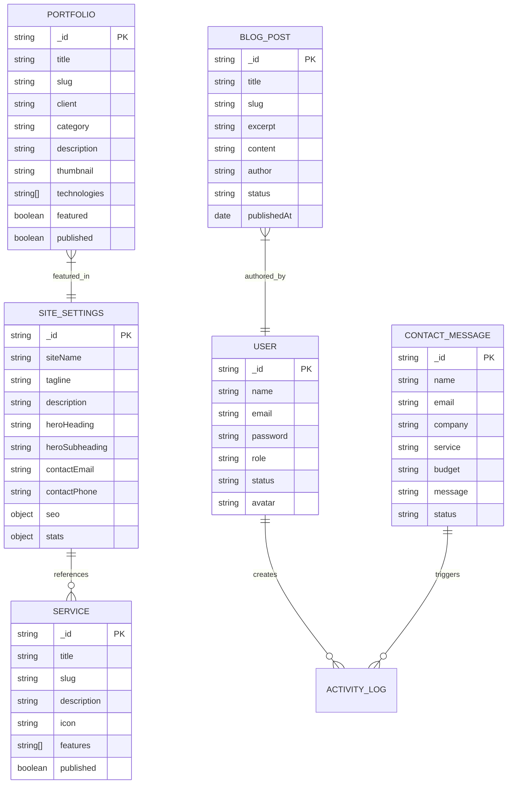

# Bab 06 — Database & Skema Mongoose

Sistem ini menggunakan **MongoDB** dengan **Mongoose ODM**. Terdapat **15 Koleksi Model** terstruktur yang mengelola seluruh konten dan aktivitas aplikasi.

## 6.1 Entity Relationship Diagram (ERD)

## 6.2 Daftar 15 Model Mongoose

1. **`User`** (`src/models/User.ts`): Menyimpan data pengguna admin (`SUPER_ADMIN`, `ADMIN`, `EDITOR`) dengan enkripsi password bcrypt.
2. **`SiteSettings`** (`src/models/SiteSettings.ts`): Menyimpan pengaturan global situs (nama situs, tagline, hero text, informasi kontak, statistik, dan SEO metadata).
3. **`Service`** (`src/models/Service.ts`): Menyimpan daftar layanan teknologi yang ditawarkan.
4. **`Portfolio`** (`src/models/Portfolio.ts`): Menyimpan studi kasus portofolio, teknologi yang digunakan, galeri gambar, dan urutan tampilan.
5. **`Technology`** (`src/models/Technology.ts`): Menyimpan data teknologi (Next.js, TypeScript, Docker, dll.), ikon, dan kategori.
6. **`ProcessStep`** (`src/models/ProcessStep.ts`): Menyimpan tahapan alur kerja pembuatan perangkat lunak (Discovery, Strategy, Design, dll.).
7. **`Testimonial`** (`src/models/Testimonial.ts`): Menyimpan ulasan klien, nama perusahaan, jabatan, ulasan, dan rating.
8. **`TeamMember`** (`src/models/TeamMember.ts`): Menyimpan profil insinyur dan desainer tim internal.
9. **`PricingPlan`** (`src/models/PricingPlan.ts`): Menyimpan paket harga dan daftar fitur paket.
10. **`BlogPost`** (`src/models/BlogPost.ts`): Menyimpan artikel blog teknis, draf/publikasi, tag, dan metadata artikel.
11. **`FAQ`** (`src/models/FAQ.ts`): Menyimpan daftar pertanyaan umum beserta jawaban dan kategori.
12. **`ContactMessage`** (`src/models/ContactMessage.ts`): Menyimpan masukan/inquiry dari pengunjung publik (`NEW`, `READ`, `REPLIED`, `ARCHIVED`).
13. **`Media`** (`src/models/Media.ts`): Catalog pustaka media gambar yang diunggah.
14. **`ActivityLog`** (`src/models/ActivityLog.ts`): Mencatat riwayat audit aksi pengguna admin (login, pembuatan data, penghapusan data).
15. **`PageVisit`** (`src/models/PageVisit.ts`): Pelacak kunjungan analitis halaman publik (URL path, IP hash, user agent).

## 6.3 Pengindeksan Database (Database Indexes)

Untuk menjamin performa query yang optimal, Mongoose mengaplikasikan indeks unik pada atribut penanda:
- `User.email`: Unique Index (`{ unique: true }`)
- `Portfolio.slug`: Unique Index (`{ unique: true }`)
- `Service.slug`: Unique Index (`{ unique: true }`)
- `BlogPost.slug`: Unique Index (`{ unique: true }`)
- `PageVisit.createdAt`: Indexing Waktu Kunjungan
